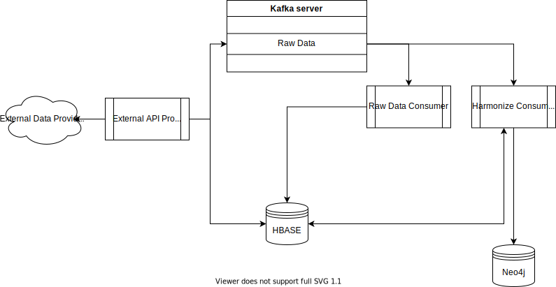

# Import raw data to the system

TThis project contains the API and applications to import the different sources to the BIGG system.

The architecture used for the import and harmonization of the sources is as follows:

The different components of the architecture are depicted in the following list:

- **External API Producer (This project):** This component is in charge to communicate to the different external providers and make the pertinent requests to obtain the data. This component is able to store the data directly to *HBASE* or send it to the *KAFKA* to be processed later. 
- **Raw Data Consumer:** This component consumes the raw data from *KAFKA* and stores its components directly to *HBASE*. This is done to always keep the original information without any modification.
- **Harmonize Consumer:** This component consumes the raw data from *KAFKA* or *HBASE* and applies the harmonization to transform this data to the data model. Finally, it stores the data in *Neo4j* or *HBASE* as required.

The idea behind this import of raw data is to save the information with minimal changes and transformations, providing
permanent access to the raw data obtained from each source.

The following links will provide information of each data source import tool:

1. [GPG (Gestió de patrimoni de la generalitat)](GPG/README.md)
2. [Gemweb](Gemweb/README.md)
3. [Datadis](Datadis/README.md)
4. [Genercat](Genercat/README.md)
5. [IXON](Ixon/README.md)
6. [Certificats d’eficiència energètica d’edificis](DadesObertes/CEEE/README.md)
